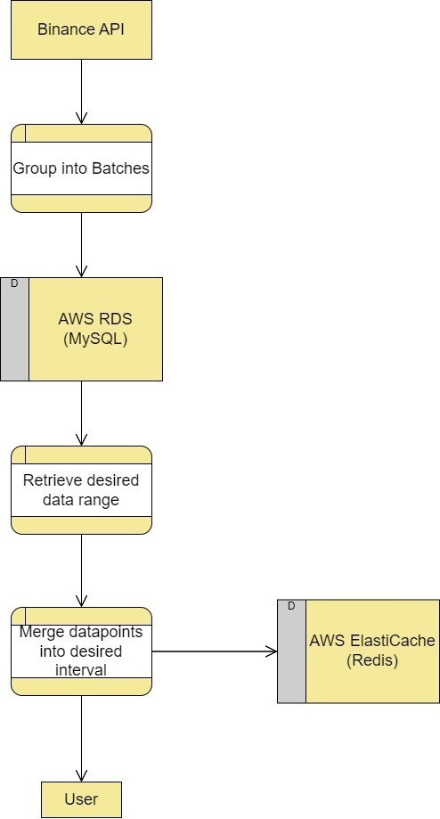

# Getting Started

### Reference Documentation

For further reference, please consider the following sections:

* [Official Apache Maven documentation](https://maven.apache.org/guides/index.html)
* [Spring Boot Maven Plugin Reference Guide](https://docs.spring.io/spring-boot/docs/3.0.4/maven-plugin/reference/html/)
* [Create an OCI image](https://docs.spring.io/spring-boot/docs/3.0.4/maven-plugin/reference/html/#build-image)
* [Spring Web](https://docs.spring.io/spring-boot/docs/3.0.4/reference/htmlsingle/#web)

### Guides

The following guides illustrate how to use some features concretely:

* [Building a RESTful Web Service](https://spring.io/guides/gs/rest-service/)
* [Serving Web Content with Spring MVC](https://spring.io/guides/gs/serving-web-content/)
* [Building REST services with Spring](https://spring.io/guides/tutorials/rest/)

### What is your project?

This project is a backend system developed 
using Spring Boot and written in Java. 
It provides users with the ability to 
query and store historical Kline (candlestick) data for all 
cryptocurrencies available. The data is
stored in an AWS RDS MySQL database. 
Users can request any cryptocurrency 
quote data through the project's API, 
and the backend can return data for 
custom timeframes to better fit users'
needs. To enhance performance, commonly
used timeframes are cached using 
AWS ElastiCache (Redis).

### Prerequisites

- Docker

### How should I run it?

1. Clone the repository

    <pre>git clone https://github.com/shizhigu/crypto_spring.git </pre>

2. Set up your MySQL and Redis instances and configure the database connection details in the ```src/main/resources/application.properties``` file.
   

3. Navigate to the project directory:

   <pre>cd crypto_spring </pre>


4. Build Docker image

   <pre>docker build -t crypto-spring:crypto . </pre>


5. Run image in a container

   <pre>docker run -p {YOUR_LOCAL_PORT}:8888 crypto-spring:crypto </pre>


### How should I load data?

To load Kline data into database, you can access the API endpoint by making a request to the following URL:

 <pre> http://localhost:{YOUR_LOCAL_PORT}/insertKline?symbol={symbol}&startTime={start}&endTime={end} </pre>


Here's a breakdown of the query parameters in the URL:


- symbol: The trading pair symbol (e.g., BTCUSD)

- startTime: The start time of the desired data range in Unix timestamp format (e.g., 1643704518000)

- endTime: The end time of the desired data range in Unix timestamp format (e.g., 1675240518000)


### How should I get data


To get Kline data, you can access the API endpoint by making a request to the following URL:

 <pre> http://localhost:{YOUR_LOCAL_PORT}/findbytime?symbol={symbol}&startTime={startTime}&endTime={endTime}&frequency={frequency} </pre>

Here's a breakdown of the query parameters in the URL:


- symbol: The trading pair symbol (e.g., BTCUSD)

- startTime: The start time of the desired data range in Unix timestamp format (e.g., 1643704518000)

- endTime: The end time of the desired data range in Unix timestamp format (e.g., 1675240518000)

- frequency: The time interval in minutes for each data point (e.g., 1440 for daily data)


### UML(not class diagram, flow diagram)

